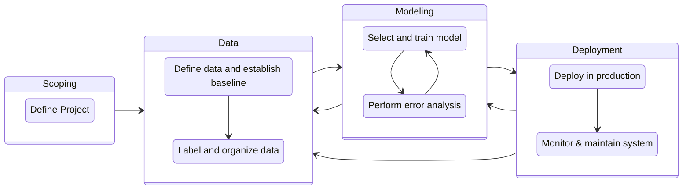

# Deployment and Production

For a more in depth overview I highly recommended the [Machine Learning Engineering for Production (MLOps) Specialization](https://www.coursera.org/specializations/machine-learning-engineering-for-production-mlops) on Coursera.

## POC to Production Gap

Machine learning model code is only a small part of your entire development. There are many other things still needed, which is why even when having a Proof of Concept ("POC") model working, in for example a Jupyter Notebook, it can still be a lot of work to get to successful production. This is sometimes referred to as the "POC to Production Gap".

<figure markdown>
  { width="500", loading=lazy }
  <figcaption>Figure 1: Only a small fraction of real-world ML systems is composed of the ML code, as shown by the small grey box in the middle. The required surrounding infrastructure is vast and complex. Adapted from (D. Sculley et. al. NIPS 2015).</figcaption>
</figure>

## Project Lifecycle

Thinking through the machine learning project lifecycle is an effective way to plan out all steps that you need to work on to get your system up and running, while at the same time minimizing any surprises. An example of such framework, as suggested by Andrew Ng:

### Scoping

### Data

### Modeling

### Deployment

## Links and Learn More

[^1]:
    D. Sculley, Gary Holt, Daniel Golovin, Eugene Davydov, Todd Phillips, Dietmar Ebner, Vinay Chaudhary, Michael Young, Jean-François Crespo, Dan Dennison. Technical Debt in Machine Learning Systems, NIPS 2015. URL https://papers.nips.cc/paper/2015/hash/86df7dcfd896fcaf2674f757a2463eba-Abstract.html